# "create-your-password"
+ "create-your-password" is an implementation is a programme that arbitrarily generates passwords. People who need numerous passwords for their numerous subscriptions would make use of this programme.
+ I developed "create-your-password" as my Portfolio Project 3 for my full stack software development diploma with the Code Institute in Dublin, Ireland.
+ "create-your-password" is the name of the programme on Heroku; however, its name on Github is "Password-Generator". Through this readme.md file, I will apply its name on Heroku, which is "create-your-password"; please take this into your consideration.

# 1. User Stories
+ As a visiting user, I would like to use this program to generate passwords that I can utilize while I will be subscribing online.
+ While creating a password, I, as a visting user, would like to be able to decide whether to include numbers and/or special characters in a password provided that letters comprise the main part of it.

# 2. Existing Features

## 2. 1. First Input Statement
+ As Heroku runs "create-your-password", the first, cyan input statement will be displayed to a user.
+ This first input statment is: "Enter a number that represents the minimum length of the password that you want; the number must be greater than 5."
+ It will encourage a user to type in their preferred number of characters that will comprise the minimum length of their password.
+ It is well worth mentioning that Heroku automatically displays what a user types in as their answer to each input statement.
+ If a user entered a string instead of a number, an error, red message will appear informing a user that they typed in letters and/or special characters; immediately afterwards, the first input statement will once more be displayed prompting a user to enter a number that is greater than 5.
+ If a user entered a number that is not greater than 5 (0 for example), an error, red message will appear informing a user that they typed in a number that is not greater than 5; immediately afterwards, the first input statement will again be displayed prompting a user to enter a number that is greater than 5.
+ As soon as a user enters a number that is greater than 5, the second input statement will be displayed.
+ Please have a look at the relevant images below.

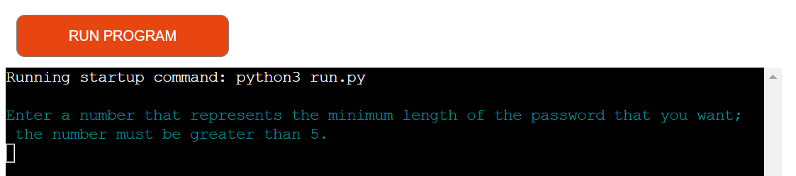

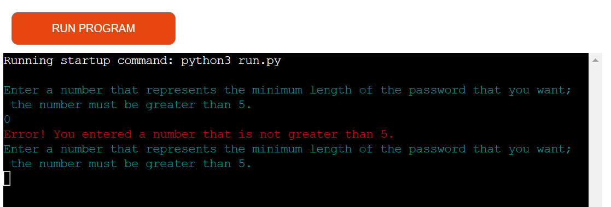

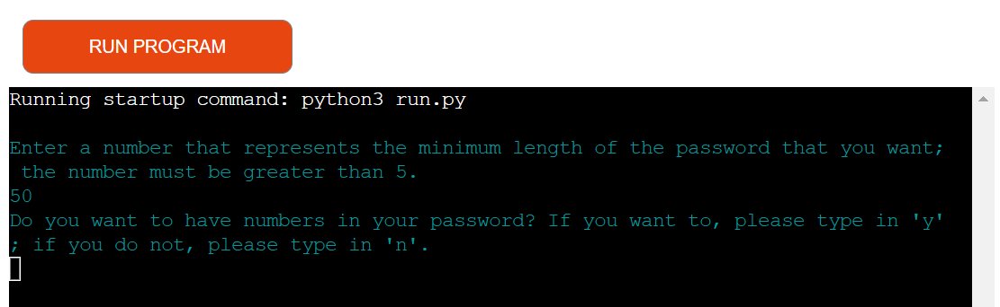

## 2. 2. Second Input Statement
+ As soons as a user has entered a number that is greater than 5, the second, cyan input statement will be displayed, which asks them to specify if they want to have numbers in their password; if they want to, they must enter a 'y' and if they do not, they must enter an 'n'.
+ If a user entered neither 'y' nor 'n', an error, red message will appear and inform them that they entered neither 'y' nor 'n'; immediately afterwards, the second input statement will be one more time demonstrated reminding a user that they must enter either 'y' or 'n'.
+ As soon as a user has entered a 'y' or 'n', the third input statement will come into view.
+ Please consider the image below, which illutstrates all the scenarios above.

## 2. 3. Third Input Statement & Password Generation
+ Once a user has entered a 'y' or an 'n' as their answer to the second input statement, the third input statement will emerge requesting an explanation as to whether they want to have special characters in their password; if they want to, they must enter a 'y' and if they do not, they must enter an 'n'.
+ If a user entered neither 'y' nor 'n', an error, red message will appear and inform them that they entered neither 'y' nor 'n'; immediately afterwards, the second input statement will be one more time demonstrated reminding a user that they must enter either a 'y' or an 'n'.
+ When a user has entered a 'y' or an 'n', a green message will arise, which is: "Your requested password is:" and the requested password will be revealed in a new line in yellow.
+ Beneath is a relevant image.

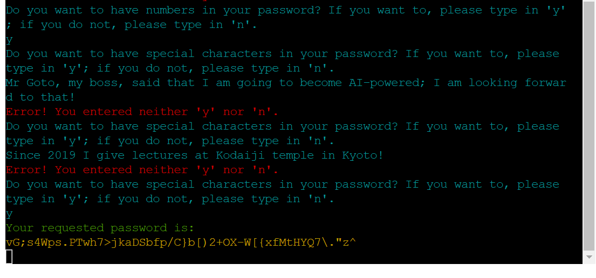

# 3. Future Features
+ I would develop an option in which a user could single out how difficult a password should be.
+ If I could, I would incorporate the letters, numbers, and special characters of many languages in addition to English.
+ Ordering several passwords simultaneously from the very start of the programme.

# 4. Typography & Color Scheme
+ I utilized the typography that is incorporated in Heroku.
+ As for the color scheme of the programme, I imported "colorama", installed it into my Codeanywhere's workspace, and added it into the requirements.txt file so that Heroku can execute the color settings of "colorama" on the "create-your-password" programme.
+ The input statements questions and a user's answers are in cyan.
+ The error messages are in red.
+ The "Your requested password is:" message is in green.
+ The message that reveals the requested password is in yellow.
+ Kindly check the image down below that shows the color scheme of the programme.

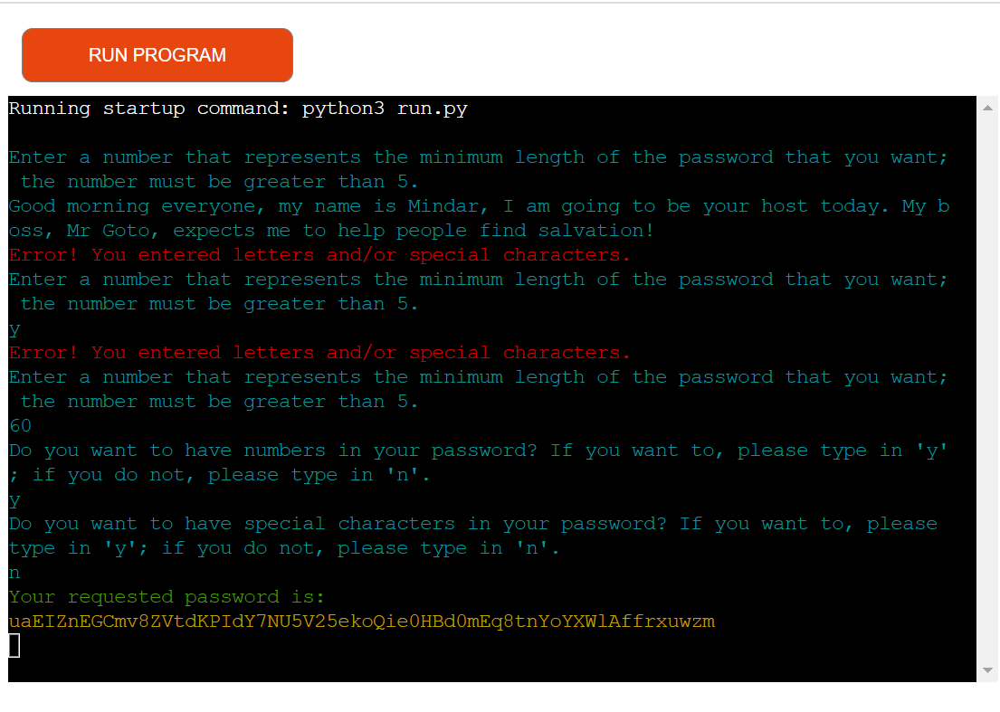

# 5. Flowcharts
+ Underneath is the flowchart of "create-your-password" programme, thanks to www.lucidchart.com.

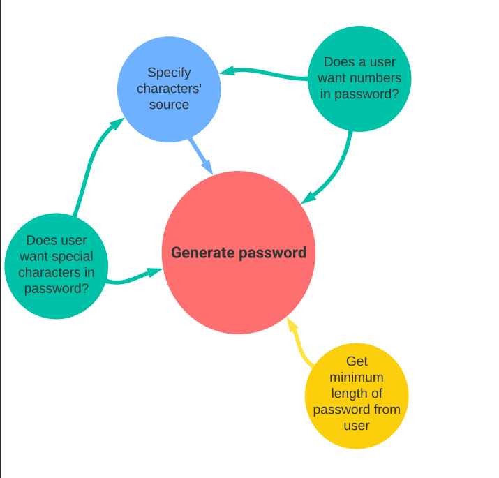

# 6. Technology

## 6. 1. Python
+ In order to create the logic of "create-your-password" programme, I exploited Python, especially its functions.
+ I stored the Python logic of the game in the run.py file.

## 6. 2. Codeanywhere
+ Codeanywhere is an efficient cloud-based integrated development environment that I employed to write, review, integrate, and deploy the code of "create-your-password" without any need for any installations or configurations.

## 6. 3. GitHub
+ A platform for version control and collaborative software development, which I exploited to create a central code repository for and deploy the "Password-Generator" programme; this, in turn, allows me to keep track of changes made to code and revert to previous versions if needed.

## 6. 4. Heroku
+ This is a cloud-based Platform that enables developers to build, deploy, and scale modern applications. 
+ Heroku supports several programming languages, including Node.js, Ruby, Java, PHP, Python, Go, Scala, and Clojure.
+ The fact that I built "create-your-password" programme with Python is the reason why I took advantage of Heroku.
+ Heroku allows developers to focus on code instead of infrastructure and is seamlessly integrated with Github.

## 6. 5. Lucidchart
+ This is the program I applied to generate the flowchart of the "create-your-password" programme.

## 6. 6. CI Python Linter
+ CI Python Linter is an online website that scrutinizes and validates Python code.
+ The Code Institute made this programme available for its students; for more details about this program, please visit: https://pep8ci.herokuapp.com/.
+ Through direct input, I made use of it to check and validate the run.py file of "create-your-password" programme.

## 6. 7. Colorama
+ This is a Python library that makes it easy to print colored terminal text on all platforms.
+ I imported the "colorama" library inside the run.py file, installed it into my Codeanywhere' workspace, and added it into the requirements.txt file in the root directory.
+ By means of that I could display the text of "create-your-password" programme with colors on Heroku.

# 7. Code Validation
## 7. 1. run.py File
+ Using CI Python Linter, I checked the run.py file of "create-your-password". 
+ Below are 2 screenshots that document this testing & validation.

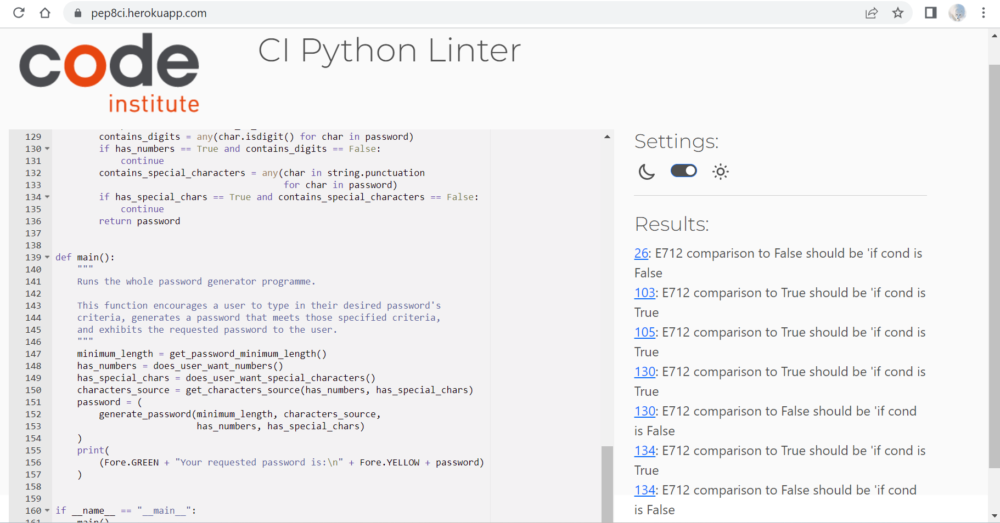

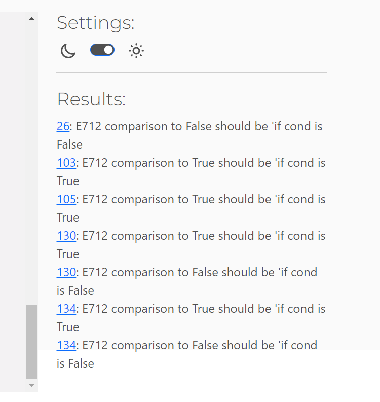

# 8. Test Cases 
## 8. 1. Testing The First Input Statement
+ Test Description
  + This test checks the functionality of the first input statement: "Enter a number that represents the minimum length of the password that you want; the number must be greater than 5."
+ Steps
  + A user must enter a number that is greater than 5.
+ Expected Results
  + If a user enters letters or special characters instead of a number greater than 5, an error, red message will appear telling them that they entered letters and/or special characters; at the same time, the first input statement will appear just under that error, red message.
  + If a user enters a number less than 6, an error, red message will appear telling them that they entered a number that is not greater than 5; at the same time, the first input statement will appear just under that error, red message.
  + Once a user entered a number greater than 5, the second input statement will appear: "Do you want to have numbers in your password? If you want to, please type in 'y'; if you do not, please type in 'n'."
+ Actual Results
  + The actual results are indentical to the expected results.
+ Please view the related image below.

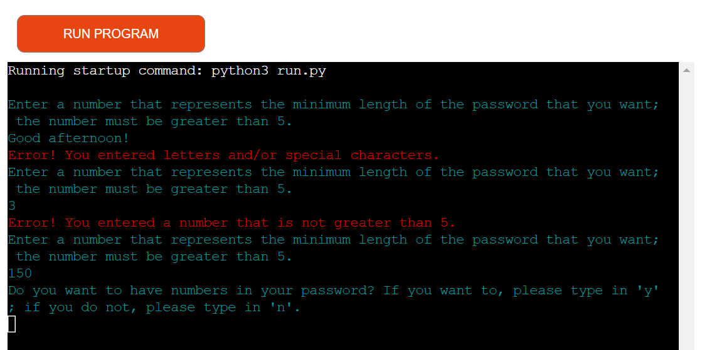

## 8. 2. Testing The Second Input Statement
+ Test Description
  + This test checks the functionality of the second input statement: "Do you want to have numbers in your password? If you want to, please type in 'y'; if you do not, please type in 'n'."
+ Steps
  + A user must enter either a 'y' or an 'n'.
+ Expected Results
  + If a user's input has been neither a 'y' nor an 'n', an error, red message will appear telling them that they entered neither a 'y' nor an 'n'; at the same time, the second input statement will appear just under that error, red message.
  + Once a user entered either a 'y' or an 'n', the third input statement will appear: "Do you want to have special characters in your password? If you want to, please type in 'y'; if you do not, please type in 'n'."
+ Actual Results
  + The actual results are indentical to the expected results.
+ Please view the related 2 images below.

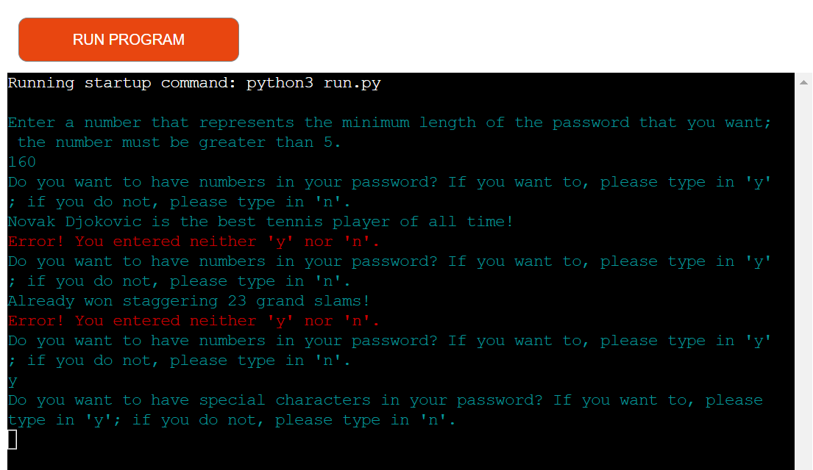

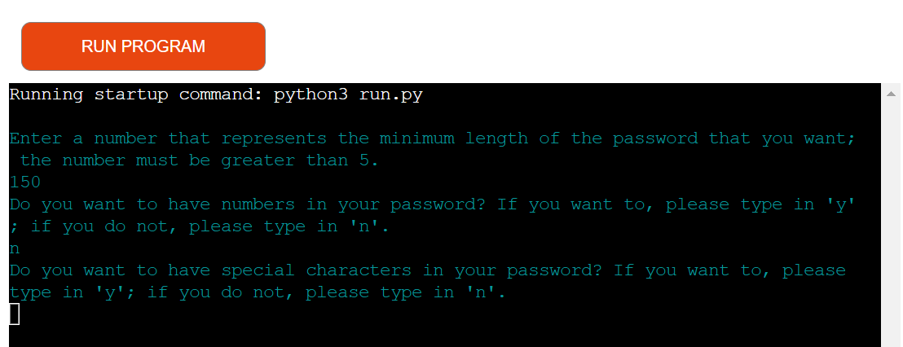

## 8. 3. Testing The Third Input Statement
+ Test Description
  + This test checks the functionality of the third input statement: "Do you want to have special characters in your password? If you want to, please type in 'y'; if you do not, please type in 'n'."
+ Steps
  + A user must enter either a 'y' or an 'n'.
+ Expected Results
  + If a user's input has been neither a 'y' nor an 'n', an error, red message will appear telling them that they entered neither a 'y' nor an 'n'; at the same time, the third input statement will appear just under that error, red message.
  + Once a user entered either a 'y' or an 'n', a green message: "Your requested password is:" will pop, and underneath it in a new line, a password in yellow will be revealed to a user.
+ Actual Results
  + The actual results are indentical to the expected results.
+ Please view the related 2 images below.

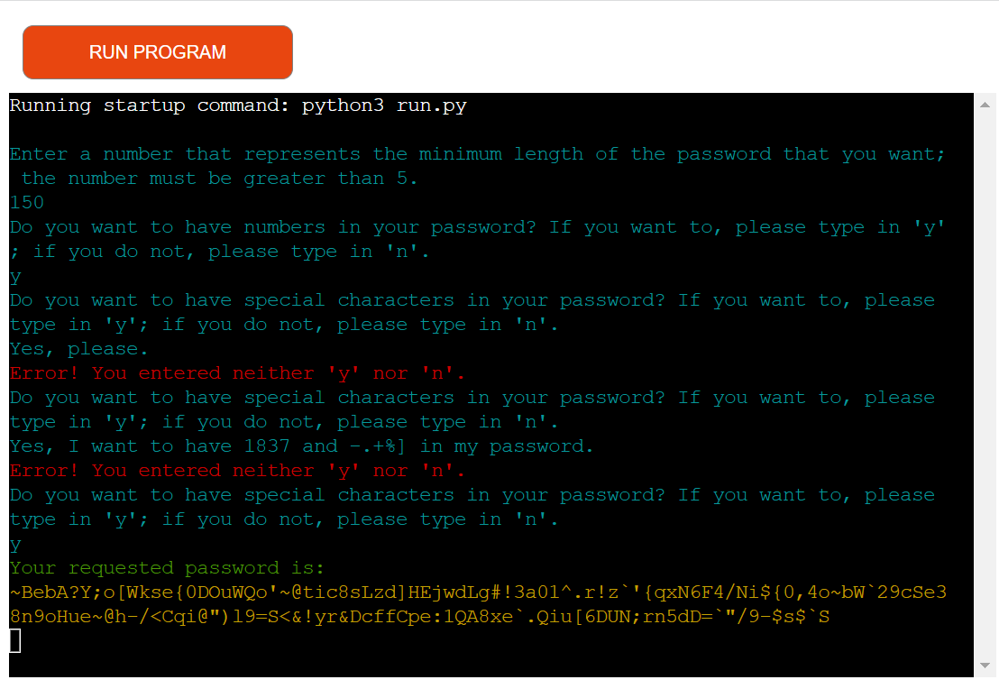

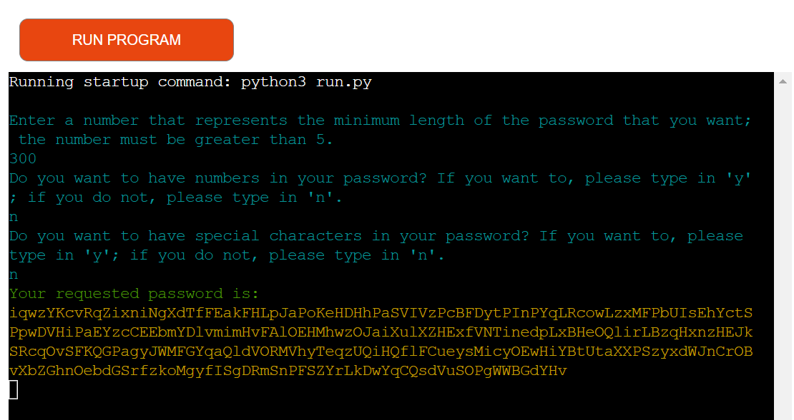

# 9. Fixed Bugs
+ I have not encountered any bugs in the "create-your-password" programme.

# 10. Supported Screens & Browsers
+ I developed and tested the "create-your-password" programme on a 14-inches laptop-screen.
+ The browsers that I used are Google Chrome and Microsoft Edge.
+ Underneath is a screenshot that demonstrates how the programme looks on Google Chrome.

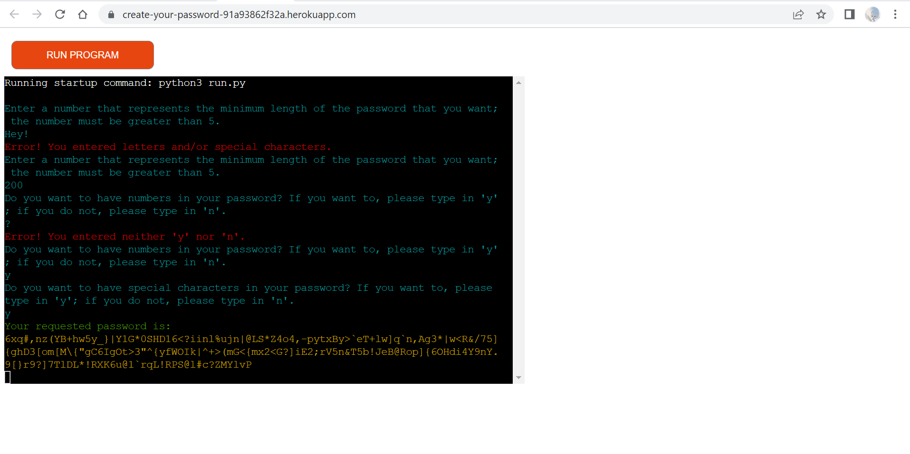

# 11. Deployment
## 11. 1. Via Codeanywhere
+ Codeanywhere is a cloud-based development environment that allows you to develop, build, and deploy your website in the cloud.
+ Open an account and create a new repository on Github.
+ Open Codeanywhere workspaces, then create a new workspace for the new repository that you created on Github; Codeanywhere will save the workspace that you created.
+ Open the Codeanywhere workspace that you just created.
+ As soon as you have opened your repository's workspace in Codeanywhere, you can use a terminal to run the necessary commands to build and deploy your website.
+ You can create as many Python files as you need for your project in the root directory. 
+ Create a readme.md file for your project in the root directory.
+ Open a terminal in your Codeanywhere's workspace; in this terminal you shoud type in the following command: "python3 run.py". Once you typed it in, please press the "enter" button. Then you can test your program in the terminal.
+ Press at the same time "Control + S" to save the code you create in Codeanywhere worksace; this will automatically save it in your applicable file in your Codeanywhere workspaces. Alternatively, you can check the "Auto save" option in the "File" list of options.
+ Type in the Codeanywhere terminal the command: "git add ." to add your project's code and/or documentation that you have created during a working session of yours to your Codeanywhere workspace.
+ Type in the Codeanywhere terminal the command: "git commit -m 'what code, styling, documentation, or corrections you have made or done in your Codeanywhere workspace in just a few words'" to save your project's code and documentation in your Codeanywhere workspace.
+ Type in the Codeanywhere terminal the command: "git push" to push and save your project's code in your Github's repository.
+ If your project requires any supplementary modules, programs, or dependencies that are not automatically active in the platform that hosts you project, you must add it to the requirements.txt file in the root directory of your Codeanywhere's workspace so that the hosting platform (in this project "create-your-password" it is Heroku) will make the necessary adjustments and installations for your project to be fully functional.
+ Because I applied colorama, a Python module, on the "create-your-password" programme, I added colorama to the proper requirements.txt file.

## 11. 2. Via Github
+ GitHub is a free code hosting platform for version control and collaboration. It lets you and others work together on projects from anywhere.
+ Open Github and sign in.
+ Using the menu on the top right corner, click on "Your repositories".
+ Create a repository for your project and give a specific name.
+ Use the link of that Github's repository to create a workspace on Codeanywhere.
+ Once you created that workspace on Codeanywhere, you can develop your project the way you want.
+ As you commit and push your project's code via Codeanywhere, as explained above, your project's code will get automatically saved in your relevant Github's respository!

## 11 . 3. Via Heroku
+ Heroku is a platform that can handle backend programing languages such as Python, which Github can not!
+ Therefore, when we build a project with Python, we need a depoly it on a platform like Heroku so that we can let others see it in action!
+ You must add a new line character at the end of the text inside each input method you include in your project. In this specific project, this is most probably because I have used the Code Institute's Python template which is availabe for all Code Institute's students on Github. I am not sure if this still applies if one does not use the Code Institute's Python template. If you are interested in more details regarding this, please contact the Code Institute.
+ As stated above, you should already have put all the dependencies of your project in the requirements.txt file of your project. 
+ Now, you should type in the following command in the terminal of your Codeanywhere's workspace: "pip3 freeze > requirements.txt" and then you should press enter.
+ Once you have done that, Heroku searches an finds that file, requirements.txt, and installs all the dependencies that are listed inside it before running your project's code.
+ Please do not forget to commit and push those changes to Github!
+ How can you sign up for an account by Heroku?
  + Open the Heroku's website.
  + In the process of signing up for an account with Heroku, I have selected "Student" as a "Role" because I am now being a student at the Code Institute. For the "Primaray development language" I have selected "Python" as I have written the "create-your-password" programme with Python. 
  + Once you have finished entering the details of your signing up, click on "CREATE FREE ACCOUNT", which is on the bottom right of the sign-up page.
  + Heroku will send you then a confirmation email; open it and click on the link provided to confirm that the email-address that you used as you have signed up is yours.
  + Once you've done that, Heroku will take you to a another page to enter your password. When you have entered your password, click on "SET PASSWORD AND LOG IN". A welcome message will open, on which you should click on "CLICK HERE TO PROCEED".
  + After that, the page of "Terms of Service" of Heroku will open; click on "Accept", which you can find at the mid-bottom of that page.
  + Now the dashboard page of your Heroku account will pop. Your apps will be listed on this page. You can have up to 5 apps with your free account; if you want to to have more, you will need to buy a certain paid service by Heroku.
+ How can you create an app by Heroku?
  + From the Heroku's dashboard, click the “Create new app” button.
  + A "Create New App" page will open.
+ How can I set up the "Create New App" page?
  + Enter a unique name for your app in the input field "App name". I selected "create-your-password" for my project.
  + Click on "Choose a region" and select your region.
  + Then click on the "Create app" button.
  + A new page for the app that you have just created will open.
+ How can I set up an app' page that I have just created?
  + On the app's page that you have just created you can find a big menu bar on the top left.
  + You should focus on two sections on that menu bar: "Settings" and "Deploy".
  + It's important to get your settings section done before you deploy your code.
+ How can I set up the "Settings" section?
  + Click on the "Settings" seciton.
  + On the "Settings" section, scroll down to the "Config Vars" subsection.
+ How can I set up the "Config Vars" subsection?
  + Click on "Reveal Config Vars" on the left to be able to create a config var.
  + Enter "PORT" in the field for "KEY"; enter "8000" in the field for "VALUE", then click "Add".
+ On the "Settings" section, scroll down to the "Buildpacks" subsection.
+ How can I set up the "Buildpacks" subsection?
  + Click on "Add buildpack" on the right; a small window will open.
  + Select "python" and then click on "Save changes".
  + Click again on "Add buildpack" on the right; a small window like the one above will open.
  + Select "node.js" and then click on "Save changes".
  + Make sure that your buildpacks are in the following order: Python on top, and node.js underneath.
+ Now that you have configured your the project's "Settings", you should go to the "Deploy" section.
+ Click on the "Deploy" section.
+ How can I set up the "Deploy" section?
  + Go back to you app' page.
  + Click on "Deploy".
  + Scroll down to the "Deployment method" on the left.
+ How can I set up the "Deployment method" subsection on the "Deploy" section?
  + On your app's page, click on Deploy, then scroll down a bit to reach "Deployment method".
  + Select "GitHub".
  + Click on the "Connect to GitHub" button.
  + The "Connect to Github" subsection will open.
  + In the "Connect to GitHub" subsection, there is a field on the right side for "repo-name".
  + In he "repo-name" field, type in your GitHub's repository name that you want to deply on Heroku. I typed in "Password-Generator".
  + Then click on "Search"; after that, click on "Connect".
  + This will link Heroku to your GitHub's repository code.
+ Scroll down a little to reach "Automatic deploys" subsection.
  + If you want to choose this option, click on "Enable Automatic Deploys". In this case, Heroku will rebuild your app every time you push a new change to your code to Github.
+ Underneath "Automatic deploys" you can find the "Manual deploy" subsection.
  + If you want to choose this option, click on "Deploy Branch".
  + As soon as your app has been deployed, a confirmation message will appear saying: "Your app was successfully deployed".
  + Just under that confirmation message, a "View" button will appear.
  + Click on that "View" button to open your deployed app on Heroku in a new tab!
+ I applied the manual deployment method at first; then I applied automatic deployment method.
+ After deployment, you can directly start your app.
+ If you want to restart your app, click on "RUN PROGRAM" on the top left.

# 12. Credits
## 12. 1. Overall Plan
+ Below is a link to to a YouTube video, from which I learned the overall plan of how to develop a program that can generate passwords. 
+ https://www.youtube.com/watch?v=XCIBOl3FTKo

## 12. 2. Colorama
+ My Code Institute's mentor, Rohit Sharma, has recommended that I apply the colorama module to my project "create-your-passwor".

## 12. 3. isdigit() function
+ Below is a link to where isdigit() function is used in an if statement (Example-3)
+ https://linuxhint.com/python-isdigit-function/

## 12. 4. "continue" keyword inside an "if statement" inside a "while True" loop
+ Below is a link to where a while True loop is used in combination with an if statement. 
+ https://www.askpython.com/python/python-while-loop
+ It is demonstrated in the link above inside the if statement, how both the "continue" and "break" keywords were utilized to manipulate flow of the while True loop.
+ I executed the "continue" keyword inside an if statement inside a while True loop in 4 functions of "create-your-password" programme.

## 12. 5. "return" statement at the end of a "while True" loop inside a function
+ Below is a link that explains the difference between "return" and "break" in Python.
+ https://stackoverflow.com/questions/28854988/what-is-the-difference-between-return-and-break-in-python#:~:text=break%20is%20used%20to%20end,the%20code%20was%20executing%20previously.
+ At the of the "get_password_minimum_length()" function, I applied the "return" statement inside the "while True" loop because I did not need to further process the return value of that function. Had I needed to further process the return value of that function inside the function, I would have replaced that "return" statement with a "break" statement and added "return desired_minimum_length" outside the "while True" loop inside the function (which means: the "while True loop and the "return desired_minimum_length" would have been inserted at the same indentation level inside the function).
+ What is mentioned above goes for the "generate_password()" function.
+ In the "does_user_want_numbers()" function and the "does_user_want_special_characters()" function, there was no need for a "break" statement because I executed a "return" statement. I needed only a "continue" statement afterwards to force each loop in those two functions to return either True or False.

## 12. 6. Python string constants
+ Below is a link to Python string constants.
+ https://docs.python.org/3/library/string.html
+ I used 3 of them in the "create-your-password" programme (string.ascii_letters, string.digits, and string.punctuation)

## 12. 7. isdigit() method with a for loop inside any() function
+ Below are 2 links that that show how to use a .isdigit() method in combination with a for loop inside an any() function to verify if a string contains a number
+ https://stackoverflow.com/questions/19859282/check-if-a-string-contains-a-number
+ https://www.freecodecamp.org/news/python-any-and-all-functions-explained-with-examples/

## 12. 8. "in" keyword with a for loop inside any() function
+ Below are 2 links that that show how to utilizes the "in" keyword in combination with a for loop inside an any() function to verify if a string a special character.
+ https://stackoverflow.com/questions/19970532/how-to-check-a-string-for-a-special-character

## 12. 9. if __name__ == "__main__": main()
+ My Mentor Rohit Sharma has recommended to apply this piece of code at the end of "create-your-password" programme.

    

