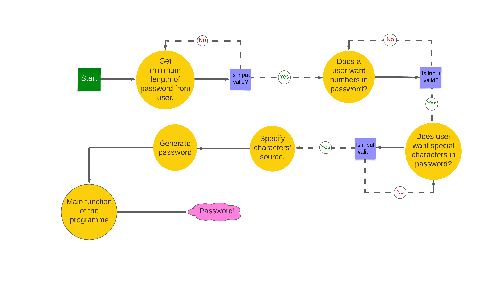

# "create-your-password"
+ "create-your-password" is an programme that generates passwords. People who require multiple passwords for their various subscriptions would benefit from using this program.
+ I developed "create-your-password" as my Portfolio Project 3 for my full-stack software development diploma with the Code Institute in Dublin, Ireland.
+ "create-your-password" is the name of the program on Heroku; however, its name on GitHub is "Password-Generator". In this readme.md file, I will refer to it as "create-your-password" on Heroku. Please take this into consideration.
# 1. User Stories
+  As a visiting user, I would like to use this program to generate passwords that I can use for online subscriptions.
+ While creating a password, as a visiting user, I would like the option to include numbers and/or special characters, while ensuring that letters make up the main part of the password.
# 2. Existing Features
## 2. 1. First Input Statement
+ When Heroku runs "create-your-password," it displays the first input statement in cyan to the user.
+ The first input statement is: "Enter a number that represents the minimum length of the password you want; the number must be greater than 5."
+ This statement prompts the user to enter their preferred number of characters for the minimum password length.
+ It's important to note that Heroku automatically shows the user's answer to each input statement.
+ If a user enters a string instead of a number, an error message in red will appear, informing them that they entered letters and/or special characters. Immediately after that, the first input statement will be displayed again, prompting the user to enter a number greater than 5.
+ Likewise, if a user enters a number that is not greater than 5 (e.g., 0), an error message in red will appear, informing them that they entered a number that is not greater than 5. Again, the first input statement will be displayed, prompting the user to enter a number greater than 5.
+ Once the user enters a number greater than 5, the second input statement will be displayed.
+ Please refer to the relevant images below.

## 2. 2. Second Input Statement
+ As soon as a user has entered a number that is greater than 5, the second, cyan input statement will be displayed, which asks them to specify if they want to have numbers in their password. If they want to, they must enter 'y', and if they do not, they must enter 'n'.
+ If a user enters neither 'y' nor 'n', a red error message will appear and inform them that they entered neither 'y' nor 'n'. Immediately afterwards, the second input statement will be demonstrated once again, reminding the user that they must enter either 'y' or 'n'.
+ Once the user has entered a 'y' or 'n', the third input statement will appear.
+ Please refer to the image below, which illustrates all the scenarios above.

## 2. 3. Third Input Statement & Password Generation
+ Once a user has entered a 'y' or an 'n' as their answer to the second input statement, the third input statement will emerge requesting an explanation as to whether they want to have special characters in their password; if they want to, they must enter a 'y' and if they do not, they must enter an 'n'.
+ If a user entered neither 'y' nor 'n', an error message will appear in red and inform them that they entered neither 'y' nor 'n'; immediately afterwards, the second input statement will be one more time demonstrated reminding a user that they must enter either a 'y' or an 'n'.
+ When a user has entered a 'y' or an 'n', a green message will arise, which is: "Your requested password is:" and the requested password will be revealed in a new line in yellow.
+ Beneath is a relevant image.

# 3. Future Features
+ I would develop an option in which a user could specify the desired difficulty level of a password.
+ If possible, I would incorporate letters, numbers, and special characters from multiple languages, in addition to English.
+ Allowing users to generate multiple passwords simultaneously from the beginning of the program.

# 4. Typography & Color Scheme
+ I used the typography that is included in Heroku.
+ As for the color scheme of the program, I imported "colorama," installed it into my Codeanywhere workspace, and added it to the requirements.txt file so that Heroku can execute the color settings of "colorama" in the "create-your-password" program.
+ The input statements' questions and the user's answers are displayed in cyan.
+ The error messages are shown in red.
+ The message "Your requested password is:" is displayed in green.
+ The message that reveals the requested password is shown in yellow.
+ Please refer to the image below for the color scheme of the program.

# 5. Flowcharts
+ Underneath is the flowchart of "create-your-password" programme, thanks to https://www.lucidchart.com/.

# 6. Technology
## 6. 1. Python
+ In order to create the logic of "create-your-password" programme, I exploited Python, especially its functions.
+ I stored the Python logic of the programme in the run.py file.
## 6. 2. Codeanywhere
+ Codeanywhere is an efficient cloud-based integrated development environment that I employed to write, review, integrate, and deploy the code of "create-your-password" without the need for installations or configurations.
## 6. 3. GitHub
+ A platform for version control and collaborative software development, which I exploited to create a central code repository for and deploy the "Password-Generator" programme; this, in turn, allows me to keep track of changes made to code and revert to previous versions if needed.
## 6. 4. Heroku
+ This is a cloud-based platform that enables developers to build, deploy, and scale modern applications.
+ Heroku supports several programming languages, including Node.js, Ruby, Java, PHP, Python, Go, Scala, and Clojure.
+ The fact that I built the "create-your-password" program with Python is the reason why I took advantage of Heroku.
+ Heroku allows developers to focus on code instead of infrastructure and is seamlessly integrated with GitHub.
## 6. 5. Lucidchart
+ This is the program I used to generate the flowchart of the "create-your-password" program.
## 6. 6. CI Python Linter
+ CI Python Linter is an online website that scrutinizes and validates Python code.
+ The Code Institute made this program available for its students; for more details about this program, please visit: https://pep8ci.herokuapp.com/.
+ I used it to check and validate the run.py file of the "create-your-password" program by directly inputting the code.
## 6. 7. Colorama
+ This is a Python library that facilitates printing colored text in the terminal across different platforms.
+ I imported the "colorama" library into the "run.py" file, installed it in my Codeanywhere workspace, and added it to the "requirements.txt" file in the root directory.
+ As a result, I was able to display the text of the "create-your-password" program with colors on Heroku.

# 7. Code Validation
## 7. 1. run.py File
+ I used the CI Python Linter to check the "run.py" file of "create-your-password".
+ Below are two screenshots documenting this testing and validation process.

# 8. Test Cases 
## 8. 1. Testing The First Input Statement
+ Test Description
  + This test checks the functionality of the first input statement: "Enter a number that represents the minimum length of the password that you want; the number must be greater than 5."
+ Steps
  + A user must enter a number that is greater than 5.
+ Expected Results
  + If a user enters letters or special characters instead of a number greater than 5, an error, red message will appear telling them that they entered letters and/or special characters; at the same time, the first input statement will appear just under that error, red message.
  + If a user enters a number less than 6, an error, red message will appear telling them that they entered a number that is not greater than 5; at the same time, the first input statement will appear just under that error, red message.
  + Once a user entered a number greater than 5, the second input statement will appear: "Do you want to have numbers in your password? If you want to, please type in 'y'; if you do not, please type in 'n'."
+ Actual Results
  + The actual results are indentical to the expected results.
+ Please view the related image below.

## 8. 2. Testing the Second Input Statement
+ Test Description
  + This test checks the functionality of the second input statement: "Do you want to have numbers in your password? If you want to, please type 'y'; if you do not, please type 'n'."
+ Steps
  + The user must enter either 'y' or 'n'.
+ Expected Results
  + If the user's input is neither 'y' nor 'n', an error message will appear in red, indicating that they entered neither 'y' nor 'n'. At the same time, the second input statement will appear just below that error message.
  + Once the user has entered either 'y' or 'n', the third input statement will appear: "Do you want to have special characters in your password? If you want to, please type 'y'; if you do not, please type 'n'."
+ Actual Results
  + The actual results are identical to the expected results.
+ Please refer to the two related images below.

## 8. 3. Testing the Third Input Statement
+ Test Description
  + This test checks the functionality of the third input statement: "Do you want to have special characters in your password? If you want to, please type 'y'; if you do not, please type 'n'."
+ Steps
  + The user must enter either 'y' or 'n'.
+ Expected Results
  + If the user's input is neither 'y' nor 'n', an error message will appear in red, informing them that they entered an invalid input. Additionally, the third input statement will appear just below the error message in red.
  + Once the user enters either 'y' or 'n', a green message saying "Your requested password is:" will appear. Below that, in a new line, a yellow password will be revealed to the user.
+ Actual Results
  + The actual results are identical to the expected results.
+ Please refer to the two related images below.

# 9. Fixed Bugs
+ I have not encountered any bugs in the "create-your-password" programme.

# 10. Supported Screens & Browsers
+ I developed and tested the "create-your-password" programme on a 14-inches laptop-screen.
+ The browsers that I used are Google Chrome and Microsoft Edge.
+ Underneath is a screenshot that demonstrates how the programme looks on Google Chrome.

# 11. Deployment
## 11. 1. Via Codeanywhere
+ Codeanywhere is a cloud-based development environment that allows you to develop, build, and deploy your website in the cloud. Follow these steps to deploy your website using Codeanywhere:
+ Open an account and create a new repository on GitHub.
+ Open Codeanywhere workspaces and create a new workspace for the new repository you created on GitHub. Codeanywhere will save the workspace for you.
+ Open the Codeanywhere workspace you just created.
+ Once you have opened your repository's workspace in Codeanywhere, use the terminal to run the necessary commands to build and deploy your website.
+ You can create as many Python files as you need for your project in the root directory.
+ Create a readme.md file for your project in the root directory.
+ Open a terminal in your Codeanywhere workspace and enter the following command: python3 run.py. Press the "Enter" button to run the command and test your program in the terminal.
+ Press "Control + S" simultaneously to save the code you created in the Codeanywhere workspace. This will automatically save it in the applicable file in your Codeanywhere workspace. Alternatively, you can check the "Auto save" option in the "File" list of options.
+ In the Codeanywhere terminal, use the command git add . to add your project's code and/or documentation created during your working session to your Codeanywhere workspace.
+ Use the command git commit -m 'Brief description of the changes you made in your Codeanywhere workspace' in the Codeanywhere terminal to save your project's code and documentation in your Codeanywhere workspace.
+ Use the command git push in the Codeanywhere terminal to push and save your project's code to your GitHub repository.
+ If your project requires any supplementary modules, programs, or dependencies that are not automatically available in the hosting platform (in this case, Heroku), you must add them to the requirements.txt file in the root directory of your Codeanywhere workspace. This allows the hosting platform to make the necessary adjustments and installations for your project to be fully functional.
+ Since the "create-your-password" program uses the Python module "colorama," make sure to add "colorama" to the requirements.txt file.

## 11. 2. Via GitHub
+ GitHub is a free code hosting platform for version control and collaboration. It allows you and others to work together on projects from anywhere.
+ Open GitHub and sign in.
+ Using the menu in the top-right corner, click on "Your repositories".
+ Create a repository for your project and give it a specific name.
+ Use the link of that GitHub repository to create a workspace on Codeanywhere.
+ Once you have created the workspace on Codeanywhere, you can develop your project the way you want.
+ As you commit and push your project's code via Codeanywhere, as explained above, your project's code will automatically be saved in your relevant GitHub repository!

## 11 . 3. Via Heroku
+ Heroku is a platform that can handle backend programing languages such as Python, which Github can not!
+ Therefore, when we build a project with Python, we need a deploy it on a platform like Heroku so that we can let others see it in action!
+ You must add a new line character at the end of the text inside each input method you include in your project. In this specific project, this is most probably because I have used the Code Institute's Python template which is available for all Code Institute's students on Github. I am not sure if this still applies if one does not use the Code Institute's Python template. If you are interested in more details regarding this, please contact the Code Institute.
+ As stated above, you should already have put all the dependencies of your project in the requirements.txt file of your project. 
+ Now, you should type in the following command in the terminal of your Codeanywhere's workspace: "pip3 freeze > requirements.txt" and then you should press enter.
+ Once you have done that, Heroku searches and finds that file, requirements.txt, and installs all the dependencies that are listed inside it before running the project's code.
+ Please do not forget to commit and push those changes to Github!
+ How can you sign up for an account by Heroku?
  + Open the Heroku's website.
  + In the process of signing up for an account with Heroku, I have selected "Student" as a "Role" because I am now being a student at the Code Institute. For the "Primaray development language" I have selected "Python" as I have written the "create-your-password" programme with Python. 
  + Once you have finished entering the details of your signing up, click on "CREATE FREE ACCOUNT", which is on the bottom right of the sign-up page.
  + Heroku will send you then a confirmation email; open it and click on the link provided to confirm that the email-address that you used as you have signed up is yours.
  + Once you've done that, Heroku will take you to another page to enter your password. When you have entered your password, click on "SET PASSWORD AND LOG IN". A welcome message will open, on which you should click on "CLICK HERE TO PROCEED".
  + After that, the page for "Terms of Service" on Heroku will open. Click on "Accept," which you can find at the bottom-middle of that page.
  + Now the dashboard page of your Heroku account will pop up. Your apps will be listed on this page. You can have up to 5 apps with your free account. If you want to have more, you will need to purchase a certain paid service from Heroku.
+ How can you create an app with Heroku?
  + From the Heroku dashboard, click the "Create new app" button.
  + A "Create New App" page will open."
+ How can I set up the "Create New App" page?
  + Enter a unique name for your app in the input field labelled "App name". I selected "create-your-password" for my project.
  + Click on "Choose a region" and select your region.
  + Then, click on the "Create app" button.
  + A new page for the app that you have just created will open.
+ How can I set up an app' page that I have just created?
  + On the app's page that you have just created, you can find a big menu bar on the top left.
  + You should focus on two sections in that menu bar: "Settings" and "Deploy."
  + It's important to get your settings section done before you deploy your code.
+ How can I set up the "Settings" section?
  + Click on the "Settings" section.
  + On the "Settings" section, scroll down to the "Config Vars" subsection.
+ How can I set up the "Config Vars" subsection?
  + Click on "Reveal Config Vars" on the left to be able to create a config var.
  + Enter "PORT" in the field for "KEY"; enter "8000" in the field for "VALUE", then click "Add".
+ On the "Settings" section, scroll down to the "Buildpacks" subsection.
+ How can I set up the "Buildpacks" subsection?
  + Click on "Add buildpack" on the right; a small window will open.
  + Select "python" and then click on "Save changes".
  + Click again on "Add buildpack" on the right; a small window like the one above will open.
  + Select "node.js" and then click on "Save changes".
  + Make sure that your buildpacks are in the following order: Python on top, and node.js underneath.
+ Now that you have configured your the project's "Settings", you should go to the "Deploy" section.
+ Click on the "Deploy" section.
+ How can I set up the "Deploy" section?
  + Go back to you app's page.
  + Click on "Deploy".
  + Scroll down to the "Deployment method" on the left.
+ How can I set up the "Deployment method" subsection in the "Deploy" section?
  + On your app's page, click on "Deploy," then scroll down a bit to reach the "Deployment method" section.
  + Select "GitHub."
  + Click on the "Connect to GitHub" button.
  + The "Connect to GitHub" subsection will open.
  + In the "Connect to GitHub" subsection, there is a field on the right side for "repo-name."
  + In the "repo-name" field, type in the name of your GitHub repository that you want to deploy on Heroku. I typed in "Password-Generator."
  + Then click on "Search"; after that, click on "Connect."
  + This will link Heroku to your GitHub repository code.
+ Scroll down a little to reach "Automatic deploys" subsection.
  + If you want to choose this option, click on "Enable Automatic Deploys". In this case, Heroku will rebuild your app every time you push a new change to your code to Github.
+ Underneath "Automatic deploys" you can find the "Manual deploy" subsection.
  + If you want to choose this option, click on "Deploy Branch".
  + As soon as your app has been deployed, a confirmation message will appear saying: "Your app was successfully deployed".
  + Just under that confirmation message, a "View" button will appear.
  + Click on that "View" button to open your deployed app on Heroku in a new tab!
+ I applied the manual deployment method at first; then I applied automatic deployment method.
+ After deployment, you can directly start your app.
+ If you want to restart your app, click on "RUN PROGRAM" on the top left.

# 12. Credits

## 12. 1. Overall Plan
+ Below is a link to a YouTube video from which I learned the overall plan on how to develop a program that can generate passwords.
+ https://www.youtube.com/watch?v=XCIBOl3FTKo
## 12. 2. Colorama
+ My mentor at the Code Institute, Rohit Sharma, has recommended that I apply the colorama module to my project "create-your-passwor".
## 12. 3. isdigit() function
+ Below is a link to where isdigit() function is used in an if statement (Example-3)
+ https://linuxhint.com/python-isdigit-function/
## 12. 4. "continue" keyword inside an "if statement" inside a "while True" loop
+ Below is a link to where a while True loop is used in combination with an if statement. 
+ https://www.askpython.com/python/python-while-loop
+ It is demonstrated in the link above inside the if statement, how both the "continue" and "break" keywords were utilized to manipulate flow of the while True loop.
+ I executed the "continue" keyword within an if statement inside a while True loop in four functions of "create-your-password" programme.
## 12. 5. "return" statement at the end of a "while True" loop inside a function
+ Below is a link that explains the difference between "return" and "break" in Python.
+ https://stackoverflow.com/questions/28854988/what-is-the-difference-between-return-and-break-in-python#:~:text=break%20is%20used%20to%20end,the%20code%20was%20executing%20previously.
+ In the "get_password_minimum_length()" function, I applied the "return" statement inside the "while True" loop because I did not need to process the return value any further within that function. Had I needed to further process the return value of that function within that function, I would have replaced that "return" statement with a "break" statement and added "return desired_minimum_length" outside the "while True" loop inside the function (which means: the "while True loop and the "return desired_minimum_length" would have been inserted at the same indentation level inside the function).
+ What is mentioned above goes for the "generate_password()" function.
+ As for the "does_user_want_numbers()" function and the "does_user_want_special_characters()" function, there was no need for a "break" statement because I used a "return" statement. 
+ After the "returen" statement, I needed only a "continue" statement to force each loop in these two functions to return either True or False.
## 12. 6. Python string constants
+ Below is a link to Python string constants.
+ https://docs.python.org/3/library/string.html
+ I used three of these constants in the "create-your-password" programme: string.ascii_letters, string.digits, and string.punctuation.
## 12. 7. isdigit() method with a for loop inside any() function
+ Below are two links that show how to use a .isdigit() method in combination with a for loop inside an any() function to verify if a string contains a number.
+ https://stackoverflow.com/questions/19859282/check-if-a-string-contains-a-number
+ https://www.freecodecamp.org/news/python-any-and-all-functions-explained-with-examples/
## 12. 8. "in" keyword with a for loop inside any() function
+ Below is a link that shows how to utilize the "in" keyword in combination with a for loop inside an any() function to verify if a string a special character.
+ https://stackoverflow.com/questions/19970532/how-to-check-a-string-for-a-special-character
## 12. 9. if __name__ == "__main__": main()
+ My Mentor, Rohit Sharma, has recommended applying this piece of code at the end of the "create-your-password" programme.

    

