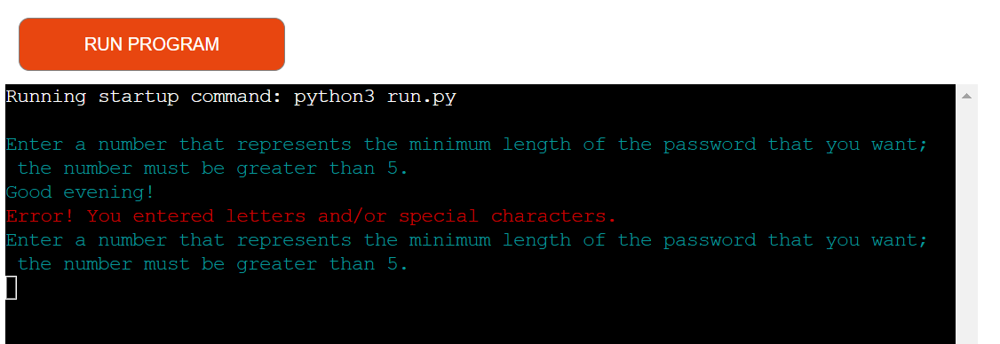

# "create-your-password"
+ "create-your-password" is an implementation is a programme that arbitrarily generates passwords. People who need numerous passwords for their numerous subscriptions would make use of this programme.
+ I developed "create-your-password" as my Portfolio Project 3 for my full stack software development diploma with the Code Institute in Dublin, Ireland.
+ "create-your-password" is the name of the programme on Heroku; however, its name on Github is "Password-Generator". Through this readme.md file, I will apply its name on Heroku, which is "create-your-password"; please take this into your consideration.

# 1. User Stories
+ As a visiting user, I would like to use this program to generate passwords that I can utilize while I will be subscribing online.
+ While creating a password, I, as a visting user, would like to be able to decide whether to include numbers and/or special characters in a password provided that letters comprise the main part of it.

# 2. Existing Features
## 2. 1. First Input Statement
+ As Heroku runs "create-your-password", the first, cyan input statement will be displayed to a user.
+ This first input statment is: "Enter a number that represents the minimum length of the password that you want; the number must be greater than 5."
+ It will encourage a user to type in their preferred number of characters that will comprise the minimum length of their password.
+ It is well worth mentioning that Heroku automatically displays what a user types in as their answer to each input statement.
+ If a user entered a string instead of a number, an error, red message will appear informing a user that they typed in letters and/or special characters; immediately afterwards, the first input statement will once more be displayed prompting a user to enter a number that is greater than 5.
+ If a user entered a number that is not greater than 5 (0 for example), an error, red message will appear informing a user that they typed in a number that is not greater than 5; immediately afterwards, the first input statement will again be displayed prompting a user to enter a number that is greater than 5.
+ As soon as a user enters a number that is greater than 5, the second input statement will be displayed.
+ Please have a look at the relevant images below.

## 2. 2. Second Input Statement
+ As soons as a user has entered a number that is greater than 5, the second, cyan input statement will be displayed, which asks them to specify if they want to have numbers in their password by typing in either 'y' or 'n'.
+ If a user entered neither 'y' nor 'n', an error, red message will appear and inform them that they entered neither 'y' nor 'n'; immediately afterwards, the second input statement will be one more time demonstrated reminding a user that they must enter either 'y' or 'n'.
+ As soon as a user has entered a 'y' or 'n', the third input statement will come into view.
+ Please consider the image below, which illutstrates all the scenarios above.

